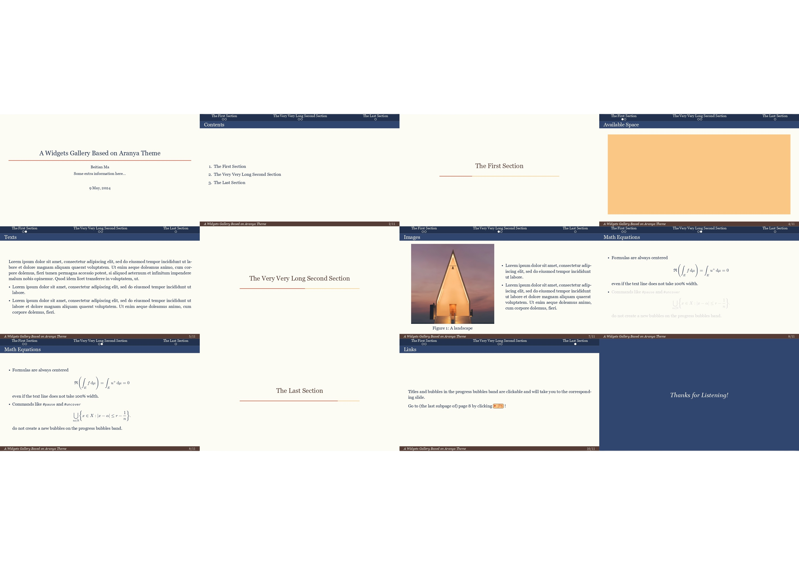

# Polylux-Widgets
This repository is a fork of [Polylux](https://github.com/andreasKroepelin/polylux), which is a package for creating presentation slides in Typst. Polylux-Widgets wants to provide a set of reusable widgets and build a bridge between theme templates and basic Polylux utilities.

## Philosophy
This repository is primarily for template designers, not template users.

I wanted to keep the Polylux itself lightweight while also allowing designers to avoid reinventing the wheel.

## An Example
I provided an [example](themes/aranya.typ) of using widgets to design templates, where I add [progress bubbles](widgets/progress-bubbles.typ) on the top of the slides. You can also use [goto buttons](widgets/goto-button.typ) to navigate between slides.



The above is an [demo](book/src/themes/gallery/aranya.typ) using this template.

## How to Use
So far I've only realized two widgets: progress bubbles which indicate page level presentation progress and goto buttons which allow you to navigate between slides.

There are roughly three steps to use widgets in your template (take progress bubbles as an example):

1. Include the widget file in your template.
    ```typ
    #import "../utils/widgets-utils.typ": register-page-info
    #import "../widgets/progress-bubbles.typ": PAGE-TYPES, progress-bubbles-band
    ```

2. Register required information of certain pages.
    ```typ
    #let slide(title: none, body) = {
        ... //

        let content = {
            register-page-info(PAGE-TYPES.slide)
            
            ...// some formatting 
            
            body 
        }
        
        logic.polylux-slide(content)
    }
    ```
    To provide page level progress information, progress bubbles need to know the physical and logical page numbers of each page. And the type (content slides or section slides) of each page is also required. `register-page-info()` function from [`widgets-utils.typ`](utils/widgets-utils.typ) is used to register this information.

3. Put the widget in the right place. I put progress bubbles on the top of the slides.
    ```typ
    #let slide(title: none, body) = {
        let header = {
            set align(top)
            if title != none {
            stack(
                dir: ttb,
                aranya-sect-band,
                aranya-heading-band(title))
            } else {
            [#aranya-sect-band]
            }
        }
        ...
    }
    ```
I omitted some details in the above code for simplicity. You can check the [example](themes/aranya.typ) for more information.

## Acknowledgements
Thanks to [@andreasKroepelin](https://github.com/andreasKroepelin) for the `polylux` package. And thanks to [@Enivex](https://github.com/Enivex) for the `metropolis` theme, which I used as a base to design the `aranya` theme.

Any suggestions or contributions are very welcome!
